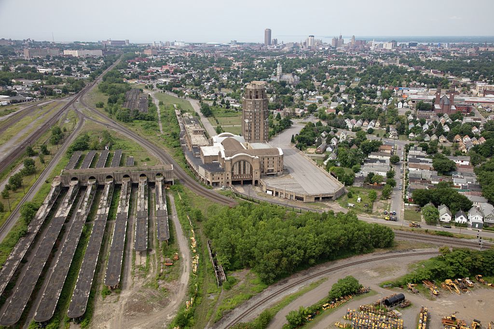

```{r}
library(dplyr)
library(ggplot2)
library(knitr)
library(scales)
library(sf)
library(tibble)

source("R/utils.R")
source("R/data_fetch.R")
source("R/data_prep.R")
source("R/maps.R")
source("R/charts.R")

site_data <- build_site_data()
window <- site_data$window
generated_label <- format(
  lubridate::with_tz(window$generated_at, tzone = site_config$timezone),
  "%b %d, %Y %I:%M %p %Z"
)
window_label <- sprintf(
  "%s to %s",
  format_date_label(window$start_date),
  format_date_label(window$end_date)
)

crime_neighborhood_rank <- site_data$crime_neighborhoods |>
  st_drop_geometry() |>
  arrange(desc(crime_count), neighborhood) |>
  slice_head(n = 10) |>
  transmute(
    Neighborhood = neighborhood,
    `Crime incidents` = format_number_label(crime_count)
  )

permit_neighborhood_rank <- site_data$permit_neighborhoods |>
  st_drop_geometry() |>
  arrange(desc(value_sum), neighborhood) |>
  slice_head(n = 10) |>
  transmute(
    Neighborhood = neighborhood,
    `Declared permit value` = format_currency_label(value_sum),
    Permits = format_number_label(permit_count)
  )

daily_chart_bundle <- build_daily_chart_bundle(site_data, window_label)
```

::::::::::::::::::::::::::::::::::::::::: page-shell
:::::::::::: masthead
::::::: masthead-copy
# Permits and crime incidents, refreshed daily.

::::::::: meta-row
::::: meta-item
::: meta-term
Window
:::

::: meta-detail
`r window_label`
:::
:::::

::::: meta-item
::: meta-term
Updated
:::

::: meta-detail
`r generated_label`
:::
:::::
:::::::::
:::::::

::::::: masthead-visual

:::::::
::::::::::::

::::: section-block
## Key signals from the current 30-day window

```{r}
build_kpi_cards(site_data$kpis)
```
:::::

:::::: section-block
## Incidents, permits, and demolition activity in one view

::: main-map-frame
```{r}
make_main_map(site_data)
```
:::
::::::

:::::: section-block
## Where recent crime counts are concentrated

::: support-map-frame
```{r}
make_summary_map(
  site_data$crime_neighborhoods,
  value_col = "crime_count",
  title = "30-day crime count",
  palette = site_config$palette$crime_fill,
  value_format = format_number_label
)
```
:::
::::::

:::::::::::: section-block
## Daily totals

::::::::: chart-grid
::: chart-card
### Total crime incidents per day

```{r}
#| fig-width: 7
#| fig-height: 4.8
#| out-width: "100%"
#| dev: ragg_png
#| fig-alt: !expr daily_chart_bundle$crime$alt_text
daily_chart_bundle$crime$plot
```
:::

::: chart-card
### Total permits per day

```{r}
#| fig-width: 7
#| fig-height: 4.8
#| out-width: "100%"
#| dev: ragg_png
#| fig-alt: !expr daily_chart_bundle$permits$alt_text
daily_chart_bundle$permits$plot
```
:::
:::::::::
::::::::::::

:::::::::::: section-block
## Neighborhood and category rankings

::::::::: table-stack
::: table-card
### Neighborhoods with the most crime incidents

```{r}
kable(crime_neighborhood_rank, align = c("l", "r"))
```
:::

::: table-card
### Neighborhoods with the highest declared permit value

```{r}
kable(permit_neighborhood_rank, align = c("l", "r", "r"))
```
:::

:::::: table-card
### Most common crime and permit categories

::::: table-pair
::: mini-table
#### Crime categories

```{r}
kable(
  site_data$top_crime_types |>
    mutate(n = format_number_label(n)),
  col.names = c("Category", "Incidents"),
  align = c("l", "r")
)
```
:::

::: mini-table
#### Permit types

```{r}
kable(
  site_data$top_permit_types |>
    mutate(n = format_number_label(n)),
  col.names = c("Type", "Permits"),
  align = c("l", "r")
)
```
:::
:::::
::::::
:::::::::
::::::::::::

:::::::: {.section-block .notes-block}
## Notes and sources

::::: notes-grid
::: note-card
### Sources

Data is pulled from Buffalo Open Data during daily render:

-   Crime Incidents: <https://data.buffalony.gov/d/d6g9-xbgu>
-   Permits: <https://data.buffalony.gov/d/9p2d-f3yt>
-   Neighborhoods: <https://data.buffalony.gov/d/ekfg-mtu8>
:::

::: note-card
### Caveats

The reporting window is calculated in `America/New_York` and includes today plus the previous 29 days. Crime data is preliminary, and both tables depend on upstream schema stability from Buffalo Open Data.
:::
:::::
::::::::

::::::: {.bottom-photo-composition}
::: {.bottom-photo-primary}

:::

::: {.bottom-photo-archive}

:::
:::::::
::::::::::::::::::::::::::::::::::::::::
